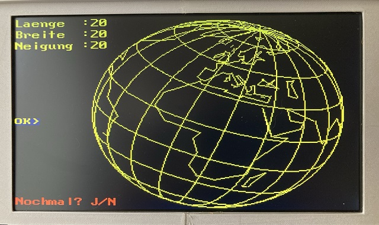
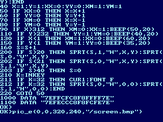
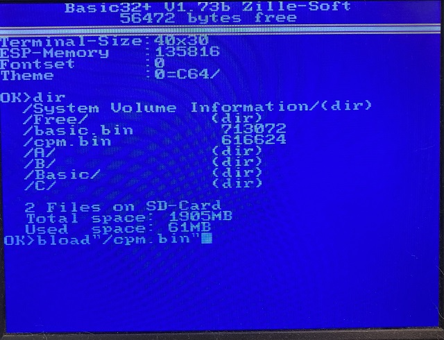
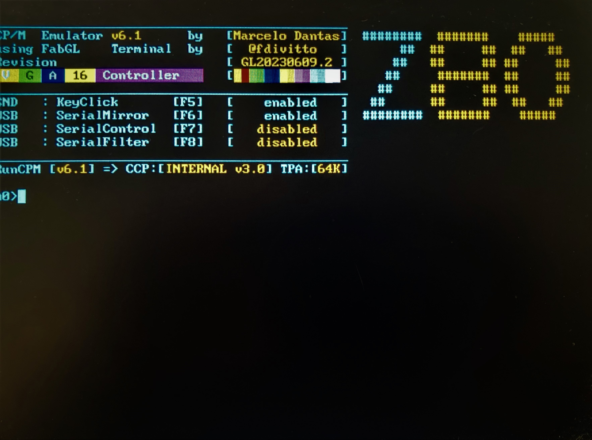

# ESP32-Basic with FabGL VGA library + PS2-Keyboard
ESP-Basic+
Basic32+ with FabGL VGA library + PS2 PS2Controller 
for VGA monitor output - May 2019       
Ursprungsversion von: Rob Cai <rocaj74@gmail.com>
erweitert/modifiziert von:Reinhard Zielinski <zille09@gmail.com>                                                                   


## Hardware:
```
-ESP32 / 240MHz 

-56472 Basic Bytes free

-VGA-Display 320x240 Pixel 64 Farben oder 400x300 Pixel 64 Farben oder AV (IO26)

-IO-Erweiterung mit MCP23017 (2x8 IO-Ports) + EEPROM 512kB 

-FRAM 512kB (Adafruit SPI FRAM)

-PS2-Keyboard 

-RTC DS3231 

-SD-Card
```


## Software:
```
Die Version meiner Vor-Authoren wird die Grundlage für einen erweiterten Basic-Interpreter
die Grundversion wurde erweitert durch:   

-fliesskomma Arithmetik

-Grafikfunktionen 	

-mathematische Funktionen 	

-Stringfunktionen 	

-lange Variablennamen  	

-viele zusätzliche Befehle (DATA,READ,STRG$,LEFT$,RIGHT$,MID$,POS,TAB,SPC,SIN,COS,TAN,ATN,LOG,SQR,PI usw.) 	

-erweiterte logische Operatoren (AND, OR) 	

-BIT-Manipulation &,|,%,<<,>> usw. 	

-Klammerrechnung 	

-IF THEN ELSE Abfragen 	

-Speichermonitor 	

-Exponential-Ein/Ausgabe 	

-Verschiedene Sensoren und Komponenten HC-S04, Dallas DS18S20, DHT, LCD, Neopixel-LED, BMP180 	

-Zeileneditor 

-BMP-Bilddatei-Import / Export

-Spritefunktionen (noch in der Entwicklung)

-Soundfunktionen (noch in der Entwicklung)

-integrierte Kurzhilfe

-RUN-CPM kann mit BLOAD"/cpm.bin" gestartet werden (Rückkehr mit EXIT) special Thanks on Guido Lehwalder and Marcelo Dantas ->RUN-CPM is a amazing Work!

```
 
```
-Startbildschirm
```

```
-Programm Globus.Bas
```

```
-Darstellung einer BMP-Datei
```

```
-Programmlisting
```


```
Screenshot als BMP-Datei exportiert
```


```
...mit BLOAD kann dann auch CPM gestartet werden.
```


```
...RUN-CPM Startbildschirm , mit EXIT kehrt man wieder zum Basic32+ zurück.
```

## Komponenten:

-ESP32 NodeMCU https://www.berrybase.de/esp32-nodemcu-development-board?sPartner=g_shopping&gclid=EAIaIQobChMI-fTJwNmx_wIVkupRCh1mTAgZEAQYBSABEgKjwvD_BwE

-MCP23017 https://www.reichelt.de/i-o-erweiterung-16bit-1-8-5v-seriell-i2c-dip-28-mcp-23017-e-sp-p140074.html?&trstct=pos_0&nbc=1

-FRAM 512kB https://www.adafruit.com/product/4719

-SD-Card Modul https://www.reichelt.de/arduino-sd-karten-modul-ard-module-sd-p282683.html?PROVID=2788&gclid=EAIaIQobChMIqL3-sdqx_wIVQ9rVCh1oSQiAEAQYAiABEgL9BPD_BwE

-RTC-Modul https://www.reichelt.de/entwicklerboards-praezisions-echtzeituhr-ds3231-debo-rtc-uhr2-p235506.html?PROVID=2788&gclid=EAIaIQobChMImaDrzNqx_wIVQs7VCh1VowhwEAQYBCABEgLQoPD_BwE

-siehe auch BOOM-List im Ordner Schematic ->folgt bald

 ### Author:Reinhard Zielinski <zille09@gmail.com> April 2021
