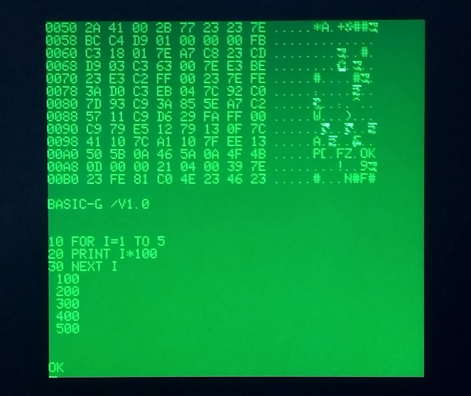
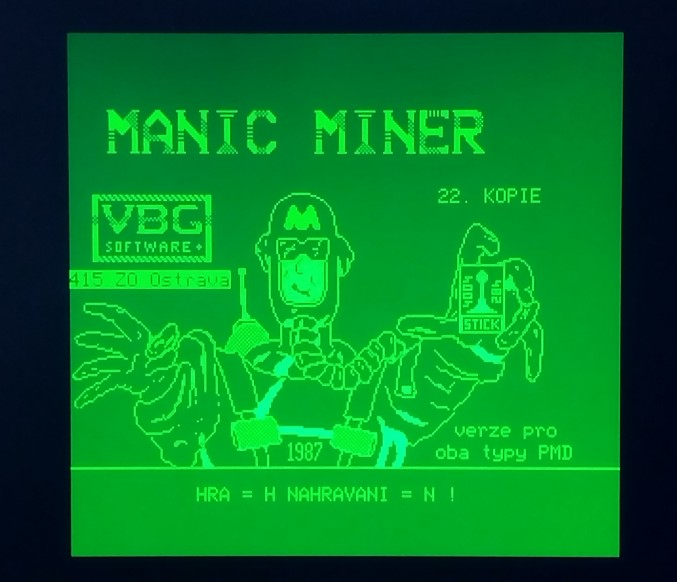
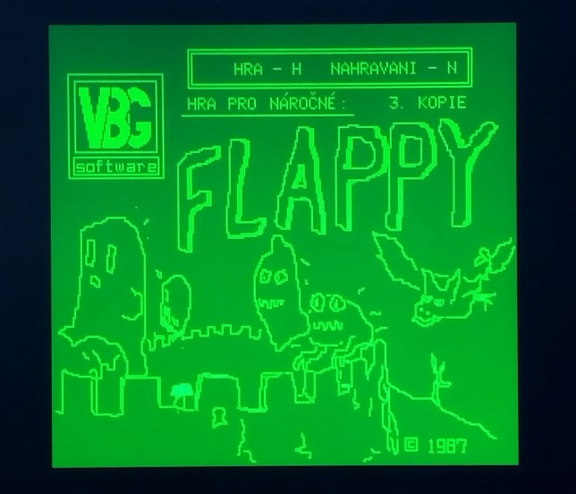
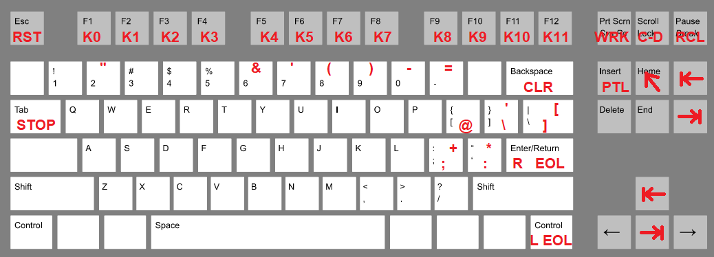

PMD 85 emulator using FabGL
===========================

The great FabGL library created by Fabrizio Di Vittorio delivers above all graphics library for ESP32 in conjunction with a VGA monitor. In addition to its own library, on the basis of which you can build your own project, it also contains a number of examples for library usage. Among them are emulators of old 8-bit computers from the era about 40 years ago. E.g. here you will find computers Altair 8800, Commodore VIC-20 and even a 16-bit IBM XT computer with a number of optional operating systems.

About 40 years ago, an 8-bit PMD 85 computer appeared in Czechoslovakia, which was among the first microcomputers with output to a television screen. Information about it you can find for example at https://en.wikipedia.org/wiki/PMD_85 or https://pmd85.borik.net/wiki/Intro . Performance of the FabGL library makes it relatively easy to create an emulator of such a computer on a VGA screen.

Requirements for PMD85 Emulator
-------------------------------

*   On the HW side the ESP32 WROVER module must be connected according to the diagram on the website http://www.fabglib.org . A VGA monitor and a PS2 keyboard need to be connected to the module.
*   Install the Arduino IDE (tested with version 1.8.13 up to 1.8.19) with ESP32 support. The Arduino IDE must be supplemented with the FabGL library.
*   Place the folder that contains the source files including the data folder in the folder, where Arduino saves projects on your computer.
*   After opening the project, you should be able to load the program into the ESP32 memory (instructions are on the website). The settings are the same as for the other computers in the examples FabGL shown in video tutorials.
*   If you want to use the function of recording programs from a "cassette recorder", install and use ESP32 Filesystem Uploader module for Arduino to upload content of SPIFFS (instructions are e.g. at https://randomnerdtutorials.com/install-esp32-filesystem-uploader-arduino-ide ).
*   A microSD card is not required for the function.

The principle of the emulator program
-------------------------------------

The program mainly uses FabGL library classes for work. Graphical interface application is made up of the drawScanline function, which prepares individual points for display on a VGA monitor. Pressing a key on the connected PS2 keyboard is handled in the processKeyDown and processKeyUp functions. The actual emulation of the 8080 processor is done by an instance of the i8080 class.

This part will already allow working in monitor mode or switching to BASIC G:

The second library used in the program is SPIFFS. It is used to create "cassette recorder". The programs that would be stored on tape are stored as a single tape.ptp file within SPIFFS.

The MGLD command in monitor mode will then allow you loading the program of the given number from "tape" (from tape.ptp file) - eg:

... or:

Using an emulator
-----------------

The emulator corresponds to the PMD85-1 version. The program can be controlled via the connected PS2 keyboard. The keys are transformed to the original keyboard according to the following image. Note that the PMD85-1 keyboard had one unused key and there was an unused position above the "@" character.

Conclusion
----------

In the FabGL library users gained a powerful tool for creating not only their own projects, but in the examples of emulated computers also a lot of older software created for completely different devices many years ago.

References
----------

http://www.fabglib.org  
https://github.com/fdivitto/FabGL  

* * *

Emulátor PMD 85 pomocí FabGL
============================

Skvělá FabGL knihovna, kterou vytvořil Fabrizio Di Vittorio, přináší především grafickou knihovnu pro ESP32 ve spojení s VGA monitorem. Kromě vlastní knihovny, na jejímž základě můžete postavit vlastní projekt, obsahuje i řadu příkladů pro použití knihovny. Mezi nimi jsou i emulátory starých 8bitových počítačů z doby před asi 40 lety. Např. zde najdete počítače Altair 8800, Commodore VIC-20 a dokonce i 16bitový počítač IBM XT s řadou volitelných operačních systémů.

Před asi 40 lety se v Československu objevil 8bitový počítač PMD 85, který patřil mezi první mikropočítače s výstupem na televizní obrazovku. Informace o něm najdete např. na https://en.wikipedia.org/wiki/PMD_85 nebo https://pmd85.borik.net/wiki/Intro . Výkon knihovny FabGL umožňuje poměrně snadno vytvořit emulátor takového počítače na VGA obrazovce.

Požadavky pro emulátor PMD85
----------------------------

*   Po HW stránce musí být modul ESP32 WROVER zapojený podle schéma na stránkách http://www.fabglib.org . K modulu je potřeba připojit VGA monitor a PS2 klávesnici.
*   Na osobním počítači musí být instalováno Arduino IDE (testováno s verzí 1.8.13 až 1.8.19) s podporou ESP32. Arduino IDE se doplní o knihovnu FabGL.
*   Složku, která obsahuje zdrojové soubory včetně složky data umístěte do složky, kam Arduino ukládá na vašem počítači projekty.
*   Po otevření projektu byste měli být schopni nahrát program do paměti ESP32 (návody jsou na webu). Nastavení je stejné jako u dalších počítačů v příkladech FabGL ukázaných ve video návodech.
*   Chcete-li využívat funkci nahrávání programů z "kazetového magnetofonu", instalujte a použijte modul ESP32 Filesystem Uploader pro Arduino, abyste nahráli obsah SPIFFS (návod je např. na https://randomnerdtutorials.com/install-esp32-filesystem-uploader-arduino-ide ).
*   Pro funkci není potřeba mikroSD karta.

Princip programu emulátoru
--------------------------

Program využívá pro práci především třídy knihovny FabGL. Grafické rozhraní aplikace je tvořeno funkcí drawScanline, která připravuje jednotlivé body pro zobrazení na VGA monitoru. Zmáčknutí klávesy na připojené klávesnici PS2 je zpracováno ve funkcích procesKeyDown a procesKeyUp. Vlastní emulaci procesoru 8080 provádí instance třídy i8080.

Tato část již umožní práci v monitorovém režimu nebo přepnutí do BASIC G:

Druhou knihovnou použitou v programu je SPIFFS. Ta slouží k vytvoření "kazetového magnetofonu". Programy, které by byly uloženy na kazetě, jsou v rámci SPIFFS uloženy jako jediný soubor tape.ptp.

Příkaz MGLD v režimu monitoru, pak umožní nahrát program daného čísla z "pásky" (ze souboru tape.ptp) - např.:

... nebo:

Použití emulátoru
-----------------

Emulátor odpovídá verzi PMD85-1. Program je možné ovládat přes připojenou klávesnici PS2. Klávesy jsou transformovány na původní klávesnici podle následujícího obrázku. Pozor na to, že klávesnice PMD85-1 měla jednu klávesu nepoužívanou a nad znakem "@" byla nevyužitá pozice.

Závěr
-----

V knihovně FabGL získali její uživatelé mocný nástroj na tvorbu nejen vlastních projektů, ale jak ukazují příklady emulovaných počítačů i na využití staršího software vytvořeného pro úplně jiná zařízení před mnoha lety.

Použitá literatura
------------------

http://www.fabglib.org  
https://github.com/fdivitto/FabGL  

* * *
