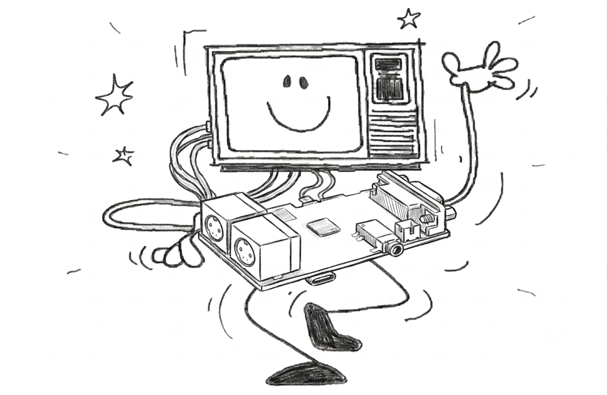
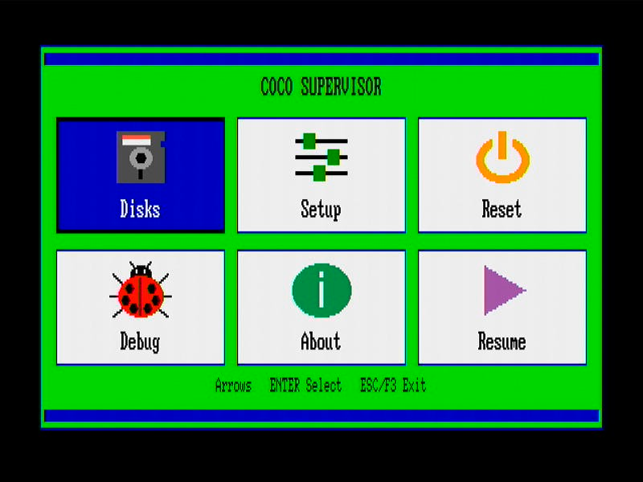

# ESP32 CoCo 2 & CoCo 3 Emulator for the ESP BOARD LilyGo TTGO VGA32



A full **TRS-80 Color Computer** (CoCo 2 and CoCo 3) emulator running on the ESP32  **[LilyGo TTGO VGA32 v1.4](https://lilygo.cc/en-us/products/fabgl-vga32?_pos=1&_sid=4c095f59b&_ss=r)** board (ESP32-WROVER). Inspired on  [XRoar](http://www.6809.org.uk/xroar/) emulator.

**v0.14.0 — October 6, 2026** (LilyGo TTGO VGA32 port)

## Features

- **One firmware, two CoCos** — CoCo 2 and CoCo 3 live in the same binary. Pick your machine at boot from NVS or flip it live in the supervisor menu.
- **Cycle-accurate to the chip** — full MC6809 CPU emulation with accurate cycle counts, faithful enough to run the software that matters.
- **Authentic video, both eras** — MC6847 VDG for CoCo 2 (text plus every semigraphics and graphics mode) and the TCC1014 GIME for CoCo 3 (512 KB RAM with MMU, 16-color palette, native graphics up to 640 px), output over crisp VGA at 640×200 @ 60 Hz via FabGL in 64-color direct mode.
- **Real-time speed** — CoCo 3 text and graphics modes run at a paced 60 FPS, the speed of the real machine (v0.12.0 rewrote the GIME video path; it used to manage ~39 FPS at the BASIC prompt and ~20 FPS in graphics).
- **Real disk drives** — WD1793 floppy controller with `.DSK` and `.VDK` support, and entire disk images cached in PSRAM for zero-latency access.
- **Complete hardware soul** — dual 6821 PIAs (keyboard, joystick, audio I/O), SAM6883 multiplexer on CoCo 2, GIME-integrated MMU on CoCo 3.
- **FUJINET SUPPORT** - External fujinet support - still experimental

### Built for Real Use

- **Multi-language keyboards** — PS/2 input with US English and Spanish Latam layouts, switchable live from Setup → Keyboard with no reboot.
- **Remap on a picture of the keyboard** — the supervisor Key Mapper draws the running machine's keyboard (CoCo 2 or CoCo 3); move over it with the arrow keys and bind a physical key to the CoCo symbol keys, the arrows and the CoCo 3-only ALT, CTRL, CLEAR, F1 and F2.
- **Joystick via PS/2 mouse** — with live, on-screen sensitivity tuning persisted in NVS.
- **Real audio out** — ESP32 internal 8-bit DAC on GPIO25, straight to a 3.5 mm jack.
- **Supervisor OSD** — an icon menu in the CoCo's own green, black and dark blue: mount disks, reset the machine, change settings, and check status without ever leaving your seat.
- **Online debugging via WiFi + MCP (experimental)** — a WiFi debug server exposes a small HTTP/JSON API to inspect and control the running 6809 (registers, memory, pause/resume, code injection, reset, machine switch, screenshot). A host-side **MCP bridge** lets Claude / LLM agents drive it live. Join your network from the supervisor's **WiFi / Debug** screen (pick it from a list and type the password, or load it from `cocowifi.cfg` on the SD card); see [docs/wifi-debug.md](docs/wifi-debug.md) and [`mcp-bridge/`](mcp-bridge/).
- **Experimental RS-232 Pak support** — for the serial tinkerers.

## Hardware Requirements

- **[LilyGo TTGO VGA32 v1.4](https://lilygo.cc/en-us/products/fabgl-vga32?_pos=1&_sid=4c095f59b&_ss=r)** (ESP32-WROVER-E, 4 MB PSRAM, 4 MB flash)
- **VGA monitor** capable of 640×200 @ 60 Hz (most VGA CRTs and adapters; some modern LCDs accept this mode, others won't sync)
- **PS/2 keyboard** plugged into the board's mini-DIN PS/2 jack
- **MicroSD card** (FAT32 formatted) inserted in the on-board socket
- **3.5 mm audio output** (mono) on the board's jack
- **5 V USB-C** for power and serial programming

> The board provides VGA, PS/2, audio jack, and SD socket on-board — no extra wiring is required. **Joystick 1 is emulated via the PS/2 mouse port** (GPIO26/27): plug a PS/2 mouse into the board's mouse header and it drives the CoCo right joystick. Joystick 2 is a neutral stub.

## Fixed Pin Map (TTGO VGA32 v1.4)

| Function | Pin(s) | Notes |
|---|---|---|
| VGA Red (R0, R1) | GPIO21, GPIO22 | Resistor-ladder DAC |
| VGA Green (G0, G1) | GPIO18, GPIO19 | Resistor-ladder DAC |
| VGA Blue (B0, B1) | GPIO4, GPIO5 | Resistor-ladder DAC |
| VGA HSYNC | GPIO23 | |
| VGA VSYNC | GPIO15 | |
| PS/2 Keyboard CLK | GPIO33 | |
| PS/2 Keyboard DATA | GPIO32 | |
| PS/2 Mouse CLK | GPIO26 | Joystick 1 emulation (PS/2 mouse) |
| PS/2 Mouse DATA | GPIO27 | Joystick 1 emulation (PS/2 mouse) |
| SD Card CS | GPIO13 | HSPI |
| SD Card MOSI | GPIO12 | HSPI |
| SD Card MISO | GPIO2 | HSPI (note: GPIO2 is a strapping pin — must float/high at boot) |
| SD Card SCK | GPIO14 | HSPI |
| Audio DAC | GPIO25 | ESP32 internal DAC1 |

## SD Card Setup

Format the MicroSD as **FAT32** and create the following structure:

### CoCo 2 ROMs

```
/roms/
├── bas13.rom          # Color BASIC 1.3 (required)
├── extbas11.rom       # Extended BASIC 1.1 (required)
└── disk11.rom         # Disk BASIC 1.1 (required for floppy support)
```

| File           | Size | Description                      |
|----------------|------|----------------------------------|
| `bas13.rom`    | 8 KB | Color BASIC 1.3 (primary)        |
| `extbas11.rom` | 8 KB | Extended BASIC 1.1 (primary)     |
| `disk11.rom`   | 8 KB | Disk BASIC 1.1 (primary)         |

### CoCo 3 ROMs

```
/roms/
├── coco3.rom          # Super Extended Color BASIC 2.0 (32 KB, required)
└── disk11.rom         # Disk BASIC (8 KB external cartridge ROM, starts with 'DK')
```

| File         | Size  | Description |
|--------------|-------|-------------|
| `coco3.rom`  | 32 KB | Super Extended Color BASIC (internal ROM, CRC: 0xb4c88d6c) |
| `disk11.rom` | 8 KB  | Disk BASIC cartridge ROM (must start with 'DK' signature at $C000) |

ROM files are validated by CRC-32 on startup.

### DriveWire / FujiNet ROMs (optional)

Only needed if you use the experimental [DriveWire / FujiNet support](#drivewire--fujinet-support-experimental)
below. Get them from [toolshed](https://github.com/n6il/toolshed)'s `hdbdos` build:

```
/roms/
├── hdbdw3bck.rom      # HDB-DOS 1.4, Becker port, CoCo 2 (8 KB)
├── hdbdw3bc3.rom      # HDB-DOS 1.4, Becker port, CoCo 3 (8 KB)
├── hdbdw3bckt.rom     # same, with a 2 s DriveWire timeout — CoCo 2 (optional)
└── hdbdw3bc3t.rom     # same, with a 2 s DriveWire timeout — CoCo 3 (optional)
```

These replace `disk11.rom` only while the DriveWire bus is enabled; with the
bus Off, `disk11.rom` loads as usual and floppy support is unaffected.

### Supported Disk Formats

- **`.DSK`** (JVC format) — fully supported
- **`.VDK`** (Virtual Disk with 12-byte header) — fully supported

## Build & Flash

### Quick Flash (Pre-built Firmware)

If you just want to flash the emulator without building from source, use the pre-built firmware binary and the browser-based ESP Web Flasher:

1. Connect your TTGO VGA32 board via USB
2. Open [ESP Web Tool](https://esptool.spacehuhn.com/) in a Chrome or Edge browser
3. Click **Connect** and select the board's serial port
4. Set the flash offset to **0x0000**
5. Choose the file `TTGO-VGA32-CoCo-0.12.2-firmware.bin` from this repository
6. Click **Program** and wait for the flash to complete

> Hold the **BOOT** button on the board while clicking Connect if the browser cannot reach the device.

Once flashed, prepare your SD card with the required ROM files (see [SD Card Setup](#sd-card-setup) above) and power-cycle the board.

---

### Running under ESP32_Bootloader (SD-card menu)

Since **v0.9.0** the emulator also ships as an [ESP32_Bootloader](https://github.com/ESP-WORKS/ESP32_Bootloader) payload, so it can share one board with other TTGO VGA32 emulators and be picked from an on-screen menu instead of being reflashed over USB.

Flash ESP32_Bootloader once (it lives in the `factory` partition), then put the release's `firmware.bin` and `version.txt` in a **`CoCo/`** folder on the card root — the folder name is what the menu lists:

```
/ (SD card root)
├── CoCo/
│   ├── firmware.bin      bare app image (NOT the merged -firmware.bin)
│   └── version.txt       one line; change it to force a reflash
└── roms/
    ├── coco3.rom
    └── disk11.rom        (plus bas13.rom / extbas11.rom for CoCo 2)
```

The ROMs and disk images stay in their usual places on the same card — the bootloader's card is also the emulator's card.

On selecting **CoCo**, the bootloader flashes the image into `ota_0` (only when `version.txt` differs from what it flashed last) and boots it. The emulator blanks `otadata` as the very first thing it does, so the **next power-cycle returns to the menu** rather than booting straight back in.

> **Use the right file.** `firmware.bin` from the SD package is the bare app image; `TTGO-VGA32-CoCo-<version>-firmware.bin` is the merged USB image and will *not* work from the menu. A bare image starts with byte `0xE9` — the build script checks this for you.

Notes and limits of this mode:

- The app must fit `ota_0` — **2816 KB**; v0.9.0 uses roughly 1.1 MB, so there is plenty of room.
- NVS (settings, key mappings, WiFi credentials, mounted disks) is shared with the bootloader and survives normally, but a full flash erase clears it.
- Nothing else changes: the standalone USB build is still the default and is unaffected.

---

### Building from Source

### 1. Install Arduino-CLI (or Arduino IDE 2.x)

This guide uses `arduino-cli`. The same FQBN and library list applies inside Arduino IDE.

### 2. ESP32 Board Support — **must be core 2.0.x**

FabGL 1.0.9 is **not compatible** with Arduino-ESP32 core 3.x (ESP-IDF 5). The board package URL and install command:

```bash
arduino-cli config add board_manager.additional_urls \
    https://espressif.github.io/arduino-esp32/package_esp32_index.json
arduino-cli core update-index
arduino-cli core install esp32:esp32@2.0.17
```

### 3. Install Required Libraries

```bash
arduino-cli lib install FabGL
```

`FabGL` provides VGA, PS/2 keyboard, and DAC drivers in one package. `SD` and `Preferences` ship with the ESP32 core.

### 4. Configure (optional)

Edit `config.h` if you want to change:

- `MACHINE_TYPE` — default compile-time machine (4 = CoCo 3, 3 = CoCo 2). The active machine is also runtime-switchable from the supervisor menu, persisted to NVS.
- `KBD_LAYOUT_FIRST_BOOT_DEFAULT` — initial PS/2 keyboard layout (0 = US English, 1 = Spanish Latam) used the first time the device boots. After that the layout is runtime-switchable (live, no reboot) from the supervisor Setup → Keyboard menu and persisted to NVS.

### 5. Compile & Upload

From the `coco3/` directory:

```bash
arduino-cli compile --fqbn esp32:esp32:esp32wrover:PartitionScheme=huge_app \
    TTGO-VGA32-COCO/

arduino-cli upload --fqbn esp32:esp32:esp32wrover:PartitionScheme=huge_app \
    -p /dev/ttyACM0 TTGO-VGA32-COCO/

arduino-cli monitor -p /dev/ttyACM0 -c baudrate=115200
```

If `Failed to connect to ESP32: Wrong boot mode detected`, hold the **BOOT** button on the board until the "Connecting..." dots appear, then release.

### 6. Building Release Images

`tools/build_firmware.sh` builds **both** distributable flavours from unmodified sources — they differ only by a command-line define, so there is nothing to edit between them:

```bash
tools/build_firmware.sh                     # both, version read from config.h
tools/build_firmware.sh 0.9.0               # both, explicit version
tools/build_firmware.sh 0.9.0 standalone    # merged USB image only
tools/build_firmware.sh 0.9.0 bootloader    # SD-card package only
```

| Output | What it is | How it's flashed |
|--------|-----------|------------------|
| `TTGO-VGA32-CoCo-<version>-firmware.bin` | Merged image: bootloader + partition table + `boot_app0` + app | USB, at offset **`0x0`** |
| `build/sdcard/CoCo/firmware.bin` | Bare app image (`-DBUILD_TARGET=1`) | By ESP32_Bootloader, into `ota_0` |
| `build/sdcard/CoCo/version.txt` | `CoCo.<version>-<git describe>` | Read by the bootloader to decide whether to reflash |

The script verifies what the binaries actually contain before publishing them: the SD image really starts with `0xE9` and fits `ota_0`, and — by disassembling `setup()` in each ELF — that the `otadata` erase is **present** in the bootloader build and **absent** from the standalone one. That last check matters because a define that silently fails to reach the sketch produces a bootloader package that never returns to the menu.

Version strings come from `FIRMWARE_VERSION` in `config.h`, which is also what the About screen and `/api/status` report. `version.txt` additionally folds in `git describe --tags --always --dirty`, so two builds of the same version are never mistaken for each other by the bootloader. Tag before building a release, and don't ship a `-dirty` string.

## Keyboard Controls

| Key | Function |
|-----|----------|
| F1  | Forwarded to CoCo 3 matrix (PA6,PB5) |
| F2  | Forwarded to CoCo 3 matrix (PA6,PB6) |
| F3  | Toggle OSD (supervisor menu) |
| F4  | Machine reset (flushes dirty disks first) |
| F5  | Toggle FPS overlay |
| F6  | Quick-mount last disk |
| ESC | BREAK |
| Backspace | LEFT ARROW (BASIC line edit) |
| Insert / Delete | CLEAR |

PS/2 keyboard layout defaults to **US English** and can be switched live (no reboot) to **Spanish Latam** from the supervisor **Setup → Keyboard → Keyboard Language** row; the choice is persisted in NVS.

The shifted-symbol row is handled by FabGL's layout (it pre-resolves SHIFT+digit into `VK_HASH`, `VK_DOLLAR`, etc.); the HAL maps each symbol back to the corresponding CoCo SHIFT+N combination so `#`, `$`, `%`, `&`, `(`, `)`, `!`, `"`, `'`, `?`, `<`, `>`, `+` all produce the right CoCo character.

### Custom Key Mapping

The supervisor **Setup → Keyboard → Key Mapper** screen draws the keyboard of the running machine — the CoCo 2 or the CoCo 3 layout — and you move over it with the arrow keys:

- **White** keys can be remapped, **cream** keys are fixed, **orange** keys already have a custom mapping. Two lines under the keyboard show what the selected key carries and its current binding.
- **ENTER** remaps the selected key: press the physical key you want, then confirm. Keys with two remappable characters (`:` / `*`, `;` / `+`, ...) first ask which one. **DEL** clears a mapping.
- **T** opens a test screen that shows what each pressed key would type without sending it to the emulated CoCo; **C** clears every mapping after a confirmation.

The remappable keys are the symbol keys, the arrows and, on a CoCo 3, ALT, CTRL, CLEAR, F1 and F2. Mappings persist in NVS.

## On-Screen Display (OSD)



Press **F3** to open the supervisor: a box in the CoCo's green, black and dark blue over the paused emulator picture. The main menu is a grid of six icon tiles — all four arrows move, **ENTER** opens a tile, **ESC** goes back one level and **F3** closes the menu from anywhere. Questions and confirmations appear as small white popups and always start on **No**.

- **Disks** — Disk Manager. A button per drive (0–3) shows what is mounted; the SD card browser sits below. **TAB** switches between drives and files. ENTER on a `.DSK`/`.VDK` image asks which drive takes it (the first empty one is preselected) and confirms before replacing a disk or mounting the same image twice; ENTER on a mounted drive asks to unmount it. **F** flushes cached writes to the SD card.
- **Setup**
  - **Machine** — switch between CoCo 2 and CoCo 3 (restarts after a confirmation; persisted to NVS)
  - **RS-232 Pak** — on/off
  - **Keyboard** — *Keyboard Language* (US English / Spanish Latam, live switch) and the *Key Mapper*, which draws the running machine's keyboard (see [Custom Key Mapping](#custom-key-mapping))
  - **Joy - Mouse Sensitivity** — joystick 1 / PS/2 mouse, with a live cursor pad
  - **WiFi / Debug** — *Config WiFi* scans for networks and takes the password from the keyboard; *Read WiFi from SD Card* loads it from `cocowifi.cfg`; plus connect, disconnect, forget, and the debug server switch (see [docs/wifi-debug.md](docs/wifi-debug.md))
  - **DriveWire** — *External Server* on/off with host, port and HDB-DOS ROM (experimental FujiNet support — see below)
- **Reset** — reset the machine, with confirmation
- **Debug** — CPU / GIME status, memory hex dump, RS-232 Pak status, Dump RAM to SD, and the **Echo Log** toggle (debug output on the serial port; it shares the port with the RS-232 Pak, so turning one on turns the other off)
- **About** — version info and free memory
- **Resume** — back to the emulator

## Architecture

The emulator runs on the ESP32-WROVER's **dual cores**, though under FabGL the video DMA is what consumes Core 1 timing — the emulation lives alongside it.

- **Core 0** — FabGL VGA scan-out timing and PS/2 ULP polling
- **Core 1** — Main emulation loop (CPU, video scanline render, audio, OSD)

### Emulation Loop

```
loop():
  1. hal_process_input()        — drain FabGL VK queue, tick deferred releases
  2. supervisor_update_and_render()  — if OSD active, render and return
  3. machine_run_frame()        — emulate 262 scanlines (14,916 CPU cycles)
  4. hal_render_frame()         — no-op on VGA32; FabGL DMA scans out continuously
```

### CoCo 2 Memory Map

```
$0000–$7FFF   RAM (up to 64 KB with SAM paging)
$8000–$9FFF   Extended BASIC ROM (8 KB)
$A000–$BFFF   Color BASIC ROM (8 KB)
$C000–$FEFF   Cartridge / Disk BASIC ROM (16 KB)
$FF00–$FF3F   PIA registers (keyboard, audio, VDG control)
$FF40–$FF5F   Disk controller (WD1793)
$FFC0–$FFDF   SAM control registers
```

### Architecture Diagrams

- `docs/ESP32_COCO_CORE.png` — CPU, memory map, PIA, VDG, SAM wiring
- `docs/Architecture.jpg` — system block diagram

## Project Structure

```
TTGO-VGA32-COCO.ino  Main Arduino sketch (setup/loop)
config.h                    Hardware and build configuration (BOARD_TYPE switch)
src/
├── core/                   Emulation core (HAL-agnostic)
│   ├── machine.h/cpp         CoCo machine — memory map, chip wiring, interrupts
│   ├── mc6809.h/cpp          MC6809 CPU — full opcode set with cycle-accurate timing
│   ├── mc6809_opcodes.h      Opcode table and cycle counts
│   ├── mc6821.h/cpp          6821 PIA — peripheral I/O
│   ├── mc6847.h/cpp          MC6847 VDG — scanline video rendering (CoCo 2)
│   ├── mc6551.h/cpp          MC6551 ACIA — RS-232 Pak chip emulation ($FF68-$FF6B)
│   ├── tcc1014.h/cpp         TCC1014 GIME — MMU, video, interrupts (CoCo 3)
│   ├── sam6883.h/cpp         SAM — address multiplexing and clock control
│   ├── sound.h/cpp           Sound mixing core — mux/DAC/single-bit, XRoar gain model
│   └── font_gime.h           GIME font ROM — 128 chars × 12 rows (PROGMEM)
├── hal/                    Hardware Abstraction Layer
│   ├── hal.h/cpp             HAL dispatcher (init, input, render)
│   ├── hal_video.cpp         FabGL VGAController (640×200 @ 60 Hz, 64-color)
│   ├── hal_audio.cpp         Internal DAC1 on GPIO25 via timer ISR
│   ├── hal_keyboard.cpp      FabGL PS/2 VirtualKey → CoCo matrix mapping
│   ├── hal_joystick.cpp      PS/2 mouse → CoCo joystick 1 (GPIO26/27); joystick 2 stub
│   ├── hal_rs232.h/cpp       RS-232 HAL — bridges MC6551 ACIA to UART0 (Serial)
│   ├── hal_storage.cpp       SD card access on dedicated HSPI
│   └── osd_canvas.h/cpp      OSD drawing API backed by FabGL Canvas (supervisor OSD)
├── supervisor/             On-Screen Display system (HAL-agnostic via osd_canvas)
│   ├── supervisor.h/cpp      OSD lifecycle and state machine
│   ├── sv_menu.h/cpp         Main menu tiles and icons; Setup, Keyboard and Debug lists; machine popup
│   ├── sv_disk.h/cpp         WD1793 FDC emulation and PSRAM cache
│   ├── sv_filebrowser.h/cpp  Disk Manager — drive buttons, SD card browser, mount popups
│   ├── sv_render.h/cpp       OSD rendering — green frame, list rows, popups
│   ├── sv_debug.h/cpp        Debug overlay — CPU status, GIME state, memory dump
│   ├── sv_joystick.h/cpp     Joy - Mouse Sensitivity popup — live cursor + adjust
│   └── sv_keymap.h/cpp       Key mapper UI — CoCo 2 / CoCo 3 keyboard picture, remap physical keys
├── roms/
│   └── rom_loader.h/cpp      ROM loading with CRC-32 validation
├── tests/
│   └── integration_test.h/cpp  LOADM binary verification
└── utils/
    ├── debug.h               Debug output macros
    └── perf_probe.h/cpp      Lightweight esp_timer-based hot-path profiler
```

## Documentation

All technical documentation is in the `docs/` directory:

| File | Description |
|------|-------------|
| [Architecture.md](docs/Architecture.md) | System architecture — CoCo 2 and CoCo 3 extensions on TTGO VGA32 |
| [core.md](docs/core.md) | MC6809 CPU, MC6821 PIA, MC6847 VDG, SAM6883, GIME machine integration |
| [coco3-gime.md](docs/coco3-gime.md) | CoCo 3 GIME porting guide, register map, MMU |
| [disk-hal.md](docs/disk-hal.md) | WD1793 FDC emulation, HALT/NMI flow, PSRAM disk cache |
| [drivewire.md](docs/drivewire.md) | DriveWire modes, Becker port, built-in server; diagrams of the floppy vs DriveWire sector path |
| [keyboard-hal.md](docs/keyboard-hal.md) | PS/2 → CoCo matrix mapping (note: older revisions describe the USB HID variant) |
| [supervisor.md](docs/supervisor.md) | OSD state machine, file browser, NVS persistence |
| [video.md](docs/video.md) | Video rendering pipeline, scale modes, palette |
| [audio-hal.md](docs/audio-hal.md) | Audio path, ISR, PIA DAC routing |
| [joystick-hal.md](docs/joystick-hal.md) | Joystick HAL — PS/2 mouse as CoCo joystick 1, comparator emulation, lessons learned |
| [rs232-hal.md](docs/rs232-hal.md) | RS-232 Pak emulation, MC6551 ACIA, HAL bridge |
| [runtime-machine-switch.md](docs/runtime-machine-switch.md) | Runtime CoCo 2 / CoCo 3 switching, NVS state |

## Known Limitations

- DMK disk format is recognized but not mountable
- Max 128 file entries in the SD card browser
- Joystick 2 (left port) is a stub — returns centered, button released; only Joystick 1 is active via PS/2 mouse
- NTSC composite simulation covers RG6 (PMODE 4) artifact colour only — there is no
  chroma/luma bleed modelling for the other modes

## DriveWire / FujiNet Support (Experimental)

The emulator can talk **DriveWire** over an emulated **Becker port**
(`$FF41` status / `$FF42` data — the same virtual port XRoar, MAME and VCC
use), paired with the HDB-DOS DriveWire ROMs. Because `fujinet-lib` and
CONFIG only ever go through HDB-DOS's `DWRead`/`DWWrite` vectors, the Becker
port is transparent to CoCo software — the same ROM that boots off a plain
DriveWire server also boots FujiNet's CONFIG app.

**What works today (External mode):**
- A TCP client to an external DriveWire/FujiNet server — [pyDriveWire](https://github.com/n6il/pyDriveWire)
  (Python 2), DW4, or [FujiNet-PC](https://github.com/FujiNetWIFI/fujinet-firmware)
  (`./build.sh -p COCO`) — on port 65504.
- HDB-DOS boots automatically once the bus is enabled, giving `DIR`, `LOADM`,
  `SAVE`, disk images, and — via FujiNet-PC — the CONFIG app, TNFS/HTTP disk
  mounts, the `N:` network device and the clock.
- Reconnects on its own after a CoCo reset or a link drop.

**Turning it on:** F3 → Setup → DriveWire → **External Server**. A popup asks for
the Host, Port (default 65504) and HDB-DOS ROM variant, and refuses to turn on
while the ROM file is missing from `/roms`, naming the file to copy. Then
Save & Restart. The screen warns when no WiFi network has been set up yet.

**Known issue — FujiNet-PC's default read timeout.** FujiNet-PC's Becker-over-IP
transport waits only 500 ms per byte by default. Since TCP never loses a byte
(only delays it), a brief WiFi retransmit can occasionally exceed that and
desync the DriveWire stream (a `Checksum error` in FujiNet-PC's log, followed
by the CoCo hanging). A one-line patch that raises this to 5 s ships at
`tools/fujinet-pc-boip-timeout.patch` — apply it to your `fujinet-firmware`
checkout before `./build.sh -p COCO` if you see this. Using the `t`-suffixed
HDB-DOS ROMs (2 s DriveWire timeout, retries instead of hanging) is a
complementary mitigation on the CoCo side.

See [docs/drivewire.md](docs/drivewire.md) for how a sector travels in each
mode, with diagrams.

## Planned

- **HD6309 CPU support** — *ongoing*. `CPU_VARIANT` already exists in `config.h`, but the core currently emulates the MC6809 only; the 6309's native mode, extra registers and inline instructions are not implemented yet.
- Testing and adjustment of RS-232 Pak support
- Migrate to an MQTT-based MCP Bridge gateway (replacing the current WiFi API)

## Changelog

### v0.14.0 — October 6, 2026

**Supervisor redesign.** Every OSD screen now shares one look, taken from the
CoCo boot screen: a green box, black text and a dark blue accent.

- **Main menu** is a 3x2 grid of icon tiles: Disks, Setup, Reset, Debug, About,
  Resume. Icons are drawn in code.
- **Disk Manager** has a button per drive, a denser file list (8 rows, names up
  to 63 characters) and popups for mounting, replacing and unmounting, all
  defaulting to No.
- **Setup** is an icon list. Machine moved here from the main menu and is now a
  popup; Keyboard Language and Key Mapper moved into a new **Keyboard**
  submenu; Mouse Sensitivity is now the **Joy - Mouse Sensitivity** popup.
- **Key Mapper** draws the CoCo 2 or CoCo 3 keyboard and is navigated with the
  arrow keys, replacing the scrolling list.
- **Debug** is an icon list; "Debug Log" moved here from Setup as **Echo Log**.
  The status, hex dump, RS-232 and Dump RAM screens use the new frame.
- **WiFi / Debug** shows a status panel above its five actions, which now fit
  without scrolling.
- **DriveWire** replaces "Mode" with an **External Server** on/off row. Turning
  it on asks for Host, Port and ROM in a popup and checks the HDB-DOS ROM is on
  the SD card. Host, Port and ROM rows show only while it is on, and a warning
  appears when WiFi is not configured.
- Screens repaint only the rows, tiles or keys that changed, so moving the
  selection no longer flickers.
- The TAB key now reaches the supervisor.

**WiFi set up from the keyboard or the SD card.** The `CoCo3-Setup` access
point and its web page are gone; the board no longer opens a network of its
own.

- **Config WiFi** (Setup → WiFi / Debug) scans, lists the networks with their
  signal strength, and takes the password from the PS/2 keyboard.
- **Read WiFi from SD Card** loads the network from `cocowifi.cfg` in the root
  of the SD card:

  ```ini
  [WiFi]
  enabled=1
  SSID=MyNetwork
  passphrase=secret
  ```

  `enabled=0` saves the network but leaves WiFi off. The file is read only when
  you choose the row, and the password in it is plain text.

### v0.12.2 — October 1, 2026

**CoCo 3 frame time roughly halved, so 60 FPS now has real headroom.** v0.12.1
ran 2–3 FPS under 60 in `WIDTH 40`, `WIDTH 80` and `HSCREEN 2`: frames were
taking almost the whole 1/60 s. They now take about half of it.

| CoCo 3 mode | v0.12.1 | v0.12.2 |
|---|---|---|
| BASIC prompt, `PMODE 4`, `HSCREEN 3` | 59–60 FPS | **60** |
| `WIDTH 40` | ~57.5 | **60** |
| `WIDTH 80` | ~56 | **60** |
| `HSCREEN 2` | ~56 | **60** |
| Full-screen `HCLS` loop in `HSCREEN 2` | — | **60** |

- **Chip-bug workaround applied only where needed.** ESP32 chips before
  revision 3 need a compiler workaround for a PSRAM bug, which slows every
  memory store. It now stays off in the CPU, GIME, PIA and audio code, which
  only store to internal RAM, and on everywhere else. This alone removed about
  40% of each frame. Build with `-DPSRAM_MEMW_KEEP` to apply it everywhere again.
- **Faster 6809 memory access.** The CPU core reads and writes ordinary RAM
  directly through a page table that follows the GIME MMU, instead of calling
  out for every byte.
- Tested with a disk game and OS-9 at a steady 60 FPS.

Older releases (v0.12.1 and earlier) are in [ChangeHistory.md](ChangeHistory.md).

## ⚠️ Vibe Coding Alert

Full transparency: this project was built by an ESP32 hobbyist working with AI coding assistants, not a professional embedded/C++ developer. If you're an experienced embedded engineer, you might look at this codebase and wince. That's okay.

The goal here was to scratch an itch — get a CoCo 2/3 emulator running on cheap VGA32 hardware — and learn along the way. The code works, but it's likely missing patterns, optimizations, or elegance that only years of embedded/C++ experience can provide.

This is where you come in. If you see something that makes you cringe, please consider contributing rather than just closing the tab. This is open source specifically because human expertise is irreplaceable. Whether it's refactoring, better error handling, cycle-accuracy fixes, or architectural guidance — PRs and issues are welcome.

Think of it as a chance to mentor an AI-assisted developer through code review. We all benefit when experienced developers share their knowledge.

## Credits

- **Reinaldo Torres / CoCo Byte Club** — ESP32 port and hardware design — [reyco2000@cocobyte.club](mailto:reyco2000@cocobyte.club)
- **Ciaran Anscomb** — [XRoar](http://www.6809.org.uk/xroar/) CoCo/Dragon emulator (original source)
- **Claude Code (Anthropic)** — co-development of the ESP32 port
- **Fabrizio Di Vittorio** — [FabGL](http://www.fabgl.com/) VGA / PS/2 / DAC library

## License

This project is licensed under the **GPL-3.0**.
